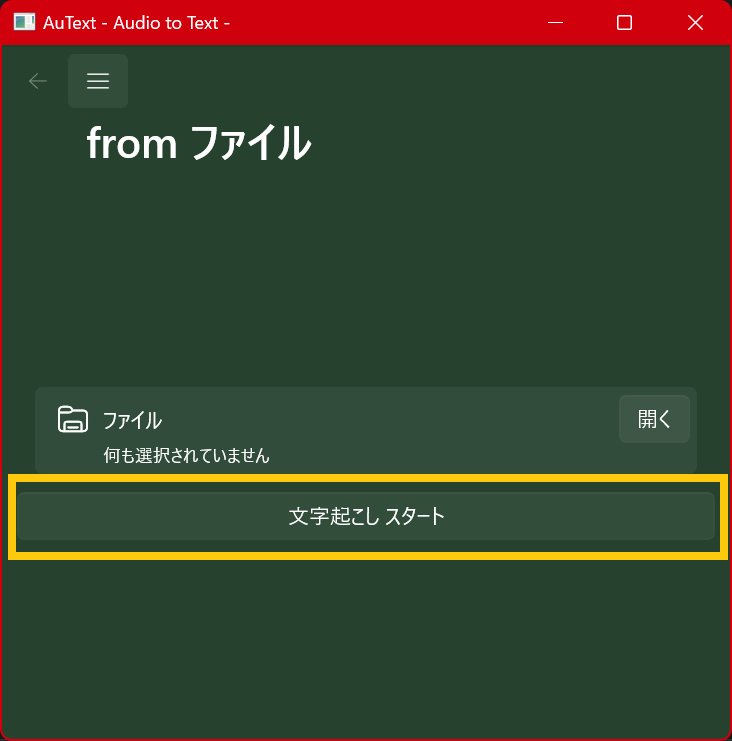

--- 
layout: default
title: Documents
subtitle: Learn more about AuText!
lang: en
---

## Open Menu

Open the menu button in the image above to open the menu field.

After opening the menu field, select what you want to do.

* "File": Transcription from an audio file is available.
* "Microphone": Transcription from microphone
* "Software": Transcription from software is available.
* "Help": Contains the website and the software version

## Setting Screen

### Download Model

Transcription models must be downloaded in advance.

Press the "Download" button, and when the download is complete, the button will change to a "Delete" button or the description will change to "Downloaded".

When downloading a Large model, it will take a considerable amount of time. Please be patient.

### Change the model used

Downloaded models can be used by changing here.

By default, tiny can be used without downloading any models.

The lower the model name, the higher the load on the computer. Please choose the most suitable one for your computer.

If the load becomes too high, your computer may crash in the worst case. Try tiny or base at first.

### Change the language in which the text is transcribed

When transcribing, you must select a language.

There is an "Auto" option, which automatically determines the language to be transcribed.

### Save the recorded sound

It automatically saves the recorded sounds and transcribed text in the folder you specify.

If you do not specify anything, it will not save.

## Transcription from audio file

Press the button "Open" and select the audio file you want to transcribe (multiple selections possible)

After making your selections, press the button "Start Transcription".

After a few moments, the transcription will be finished and the result will be displayed below.

## Transcription from microphone

Open the "From the Microphone" screen.

Press "Record" to record the microphone.

Pressing the same button again will end the recording and the result will be displayed at the bottom.

The recorded sound can also be played back.

## Transcription from Software

Open "From Software" screen

Select the audio device from which the software you want to record is generated.

Select the software you wish to record.

Press the "Record" button to record the sound being emitted by the software.

Press the same button again to finish recording and the result will be displayed below.

## help screen

The Help screen contains links to software versions and home pages.