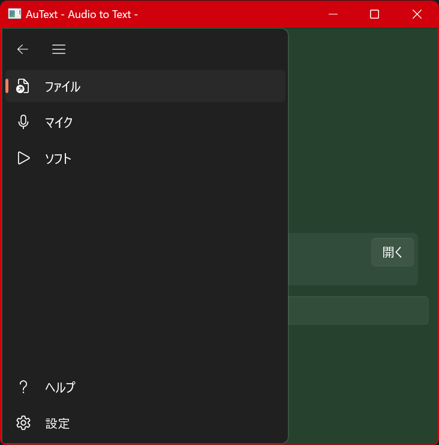
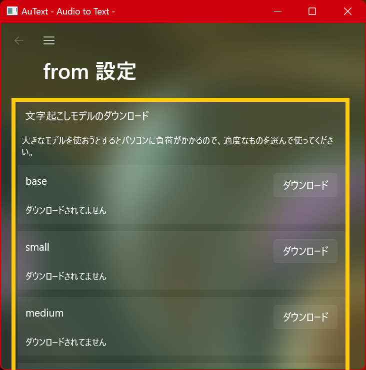
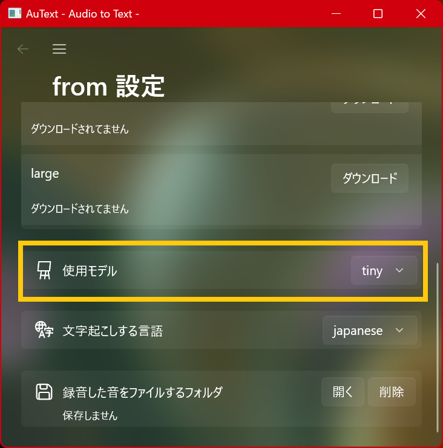
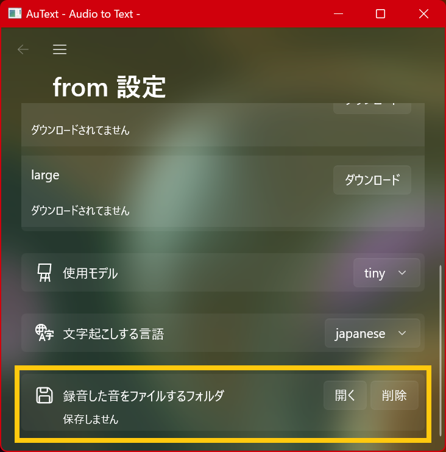
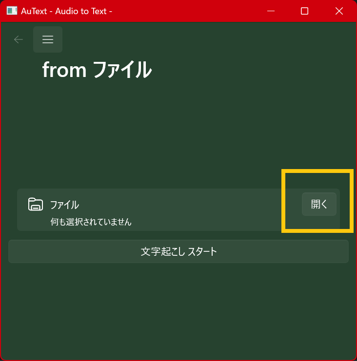
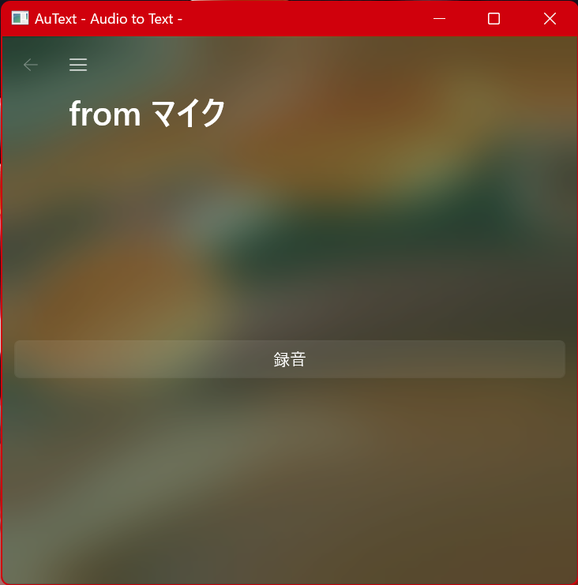
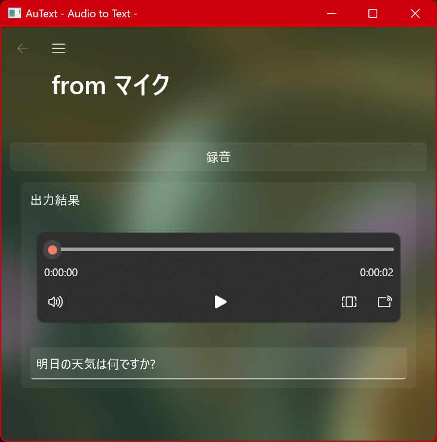
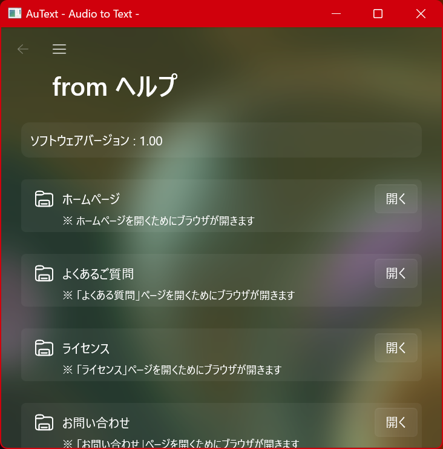

--- 
layout: default
title: Documents
subtitle: AuTextをもっと知ろう！
---

## 目次

- [メニューを開く](#メニューを開く)
- [設定画面](#設定画面)
- [「音声ファイルから」文字起こし](#音声ファイルから文字起こし)
- [「マイクから」文字起こし](#マイクから文字起こし)
- [ヘルプを開く](#ヘルプ画面)
- [「ソフトから」文字起こし](#ソフトから文字起こし)

---

## メニューを開く

上の画像のメニューボタンを開いて、メニュー欄を開く。

メニュー欄を開いたら、やりたいことを選択する。

* 「ファイル」：音声ファイルからの文字起こしが可能
* 「マイク」：マイクからの文字起こしが可能
* 「ソフト」：ソフトウェアからの文字起こしが可能
* 「ヘルプ」：ホームページや、ソフトウェアバージョンが記載されている

## 設定画面

### モデルをダウンロードする

文字起こしモデルは、事前にダウンロードしておく必要があります。

「ダウンロード」ボタンを押して、ダウンロードが終了すると、「削除」ボタンに変わったり、説明文が「ダウンロード済み」に変わります。

Largeモデルをダウンロードする際は、かなりの時間が掛かります。気長に待ってください。

### 使用するモデルを変更する

ダウンロードしたモデルは、ここを変更することにより、使用できるようになります。

デフォルトで、モデルを何もダウンロードせずとも、tinyが使用可能です。

モデル名が、下に行くほどパソコンへの負荷が高くなります。最適なものを選んで使用してください。

負荷が高くなると、最悪、パソコンがクラッシュする恐れがあります。最初は、tinyやbaseから試してみてください。

### 文字起こしする言語を変更する

文字起こしする際に、言語を選択する必要があります。

「Auto」がありますが、これは、自動で文字起こしする言語を決めてくれます。

### 録画した音を保存する

録音した音や文字起こしした文字を、自動的に、指定したフォルダに保存してくれます。

何も指定しない場合は、保存をしません。

## 「音声ファイルから」文字起こし

「開く」というボタンを押して、文字起こししたい音声ファイルを選ぶ(複数選択可)

選択が終わったら「文字起こしスタート」というボタンを押す。

しばらくすると、文字起こしが終了して、下に結果が表示される。

## 「マイクから」文字起こし

「マイクから」の画面を開く

「録音」を押せば、マイクの録音が行われる。

もう一度、同じボタンを押すと、録音が終了し、下に結果が表示される。

また、録音した音は、再生可能

## 「ソフトから」文字起こし

「ソフトから」の画面を開く

録音したいソフトが発生しているオーディオデバイスを選択

録音したいソフトを選択する。

「録音」ボタンを押せば、ソフトが発してる音の録音が行われる。

もう一度、同じボタンを押すと、録音が終了し、下に結果が表示される。

## ヘルプ画面

ヘルプ画面には、ソフトウェアバージョンやホームページへのリンクが載っています。